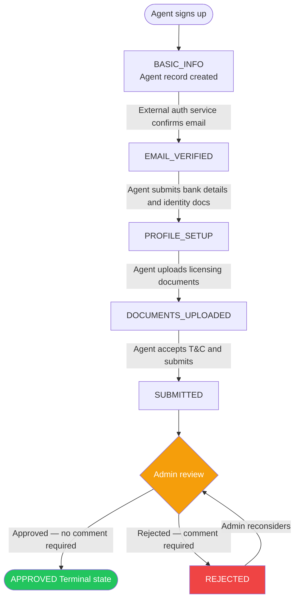

<p align="center">
  <a href="https://www.quickshelter.ng/" target="blank">
    
  </a>
</p>

<h1 align="center">QShelter Agent API</h1>
<p align="center">NestJS 10 REST API powering the QShelter Agent Dashboard (<code>agent.qshelter.ng</code>)</p>

---

## Table of Contents

- [Overview](#overview)
- [Stack](#stack)
- [Project Structure](#project-structure)
- [Domain Modules](#domain-modules)
- [Authentication & Authorization](#authentication--authorization)
- [API Reference](#api-reference)
- [Response Format](#response-format)
- [Agent Onboarding Lifecycle](#agent-onboarding-lifecycle)
- [Commission Calculation](#commission-calculation)
- [Environment Variables](#environment-variables)
- [Getting Started](#getting-started)
- [Database Migrations](#database-migrations)
- [Running Tests](#running-tests)
- [Stay in Touch](#stay-in-touch)

---

## Overview

This API owns **two domains**:

1. **Onboarding** — agent registration, document submission, licensing, and approval lifecycle.
2. **Analytics** — computed dashboard metrics (customers, commissions, sales totals).

Payment processing, wallet management, and transaction ledgers are owned by an **external financial service**. Customer data is owned by the **external mofi platform**. This API reads from those systems but **never writes to their tables**.

---

## Stack

| Concern      | Technology                              |
| ------------ | --------------------------------------- |
| Framework    | NestJS 10 + TypeScript                  |
| ORM          | TypeORM 0.3                             |
| Database     | MySQL                                   |
| Auth         | JWT (`jsonwebtoken`) + `@casl/ability`  |
| Validation   | `class-validator` + `class-transformer` |
| File uploads | AWS S3 via `@aws-sdk/client-s3`         |
| API docs     | `@nestjs/swagger` — served at `/docs`   |
| Testing      | Jest + Supertest (e2e)                  |

---

## Project Structure

```
src/
├── agent/                  # Agent onboarding (owned)
├── agent-document/         # Polymorphic licensing documents (owned)
├── agent-poc/              # Proof-of-concept agent flow (owned)
├── analytics/              # Dashboard metrics (owned, computed)
├── commission/             # 5% commission engine (owned)
├── licensing-info/         # Regulatory body info linked to documents (owned)
├── notification/           # Email / push notifications (owned)
├── referral/               # Invite links and referree tracking (owned)
├── payment/                # External — financial service (read-only)
├── transaction/            # External — financial service (read-only)
├── user/                   # External — mofi platform (read-only)
├── wallet/                 # External — financial service (read-only)
└── common/
    ├── auth/               # JWT guard + interfaces
    ├── casl/               # CASL ability factory + policy decorator
    ├── decorator/
    ├── exception/
    ├── guard/
    ├── helpers/
    ├── middleware/
    ├── pipes/
    └── validator/
```

---

## Domain Modules

### Owned (read + write)

| Module          | Table             | Notes                                                                               |
| --------------- | ----------------- | ----------------------------------------------------------------------------------- |
| `Agent`         | `agents`          | Two agent types: `QSHELTER_LICENSED`, `ELITE_PARTNER`                               |
| `AgentDocument` | `agent_documents` | Polymorphic documents attached to licensing info or directly to an agent            |
| `LicensingInfo` | `licensing_infos` | Linked to `AgentDocument` via `OneToMany`; Elite Partners require a CAC certificate |
| `Referral`      | `referrals`       | Invite links tracking referrer (Agent) ↔ referree (User)                           |
| `Commission`    | `commissions`     | Computed from external payment data; 5% default rate                                |
| `Notification`  | —                 | Email/push delivery; triggered by lifecycle transitions                             |
| `AgentPoc`      | `agent_pocs`      | Proof-of-concept agent flow                                                         |
| `Analytics`     | —                 | Aggregated metrics; no dedicated table (computed at query time)                     |

### External (read-only)

These modules map to tables owned by external services. **Never add create/update/delete operations here.**

| Module        | External Source   | Table          |
| ------------- | ----------------- | -------------- |
| `User`        | mofi platform     | `users`        |
| `Wallet`      | financial service | `wallets`      |
| `Payment`     | financial service | `payments`     |
| `Transaction` | financial service | `transactions` |

---

## Authentication & Authorization

### JWT Authentication

Every controller is protected by `@AuthGuard()` (declared in `src/common/auth/auth.guard.ts`). This decorator:

1. Extracts the `Bearer` token from the `Authorization` header.
2. Verifies it using `process.env.JWT_SECRET` (`jsonwebtoken.verify`).
3. Attaches `{ ...payload, id: payload.user_id }` to `request.user`.
4. Evaluates any `@CheckPolicies()` decorators on the handler via CASL.

**Token payload shape:**

```json
{
  "user_id": 1,
  "roles": ["AGENT"],
  "iat": 1234567890,
  "exp": 1234567890
}
```

All requests must include:

```
Authorization: Bearer <token>
```

### CASL Authorization (Role-Based)

Defined in `src/common/casl/casl-ability.factory.ts`.

| Role                           | Permissions                                                                                                             |
| ------------------------------ | ----------------------------------------------------------------------------------------------------------------------- |
| `SUPER_ADMIN`, `ADMIN`         | `manage all` — full CRUD on every resource                                                                              |
| `FINANCE_ADMIN`, `SALES_ADMIN` | `read all` — read-only across all resources                                                                             |
| `AGENT`                        | Read/update own `User` and `Agent`; create/read own `LicensingInfo`, `AgentDocument`, `Referral`; read own `Commission` |
| `USER`                         | Read/update own `User` profile only                                                                                     |

---

## API Reference

### Agents — `/agents`

| Method  | Path                             | Description                                         |
| ------- | -------------------------------- | --------------------------------------------------- |
| `POST`  | `/agents`                        | Create an agent profile (triggers onboarding email) |
| `GET`   | `/agents/paginate`               | Paginated list of all agents                        |
| `GET`   | `/agents/:id`                    | Get agent by ID                                     |
| `GET`   | `/agents/by-user/:id`            | Get agent by User ID                                |
| `GET`   | `/agents/by-referral-code/:code` | Get agent by referral code                          |
| `PATCH` | `/agents/:id`                    | Update agent profile (bank details, etc.)           |
| `POST`  | `/agents/:id/update-status`      | Admin: advance or set agent status                  |
| `GET`   | `/agents/:id/referrees`          | Paginated list of users referred by this agent      |
| `GET`   | `/agents/:id/agent-documents`    | All documents attached to this agent                |
| `GET`   | `/agents/:id/commissions`        | Paginated commissions for this agent                |
| `GET`   | `/agents/:id/total-commission`   | Sum of all commissions for this agent               |

### Agent Documents — `/agent-documents`

| Method   | Path                                 | Description                          |
| -------- | ------------------------------------ | ------------------------------------ |
| `POST`   | `/agent-documents`                   | Upload a document record             |
| `GET`    | `/agent-documents`                   | List all documents                   |
| `GET`    | `/agent-documents/:id`               | Get document by ID                   |
| `POST`   | `/agent-documents/:id/update-status` | Admin: approve or decline a document |
| `PATCH`  | `/agent-documents/:id`               | Update document metadata             |
| `DELETE` | `/agent-documents/:id`               | Delete a document                    |

### Licensing Info — `/licensing-infos`

| Method   | Path                        | Description                   |
| -------- | --------------------------- | ----------------------------- |
| `POST`   | `/licensing-infos`          | Create a licensing info entry |
| `GET`    | `/licensing-infos/paginate` | Paginated list                |
| `GET`    | `/licensing-infos/:id`      | Get by ID                     |
| `PATCH`  | `/licensing-infos/:id`      | Update                        |
| `DELETE` | `/licensing-infos/:id`      | Delete                        |

### Referrals — `/referrals`

| Method | Path                                | Description                                       |
| ------ | ----------------------------------- | ------------------------------------------------- |
| `POST` | `/referrals`                        | Create a referral link between agent and customer |
| `GET`  | `/referrals/paginate`               | Paginated list of referrals                       |
| `GET`  | `/referrals/:id`                    | Get referral by ID                                |
| `GET`  | `/referrals/by-agent/:id/referrees` | All users referred by a given agent               |

### Commissions — `/commissions`

| Method   | Path                    | Description                                              |
| -------- | ----------------------- | -------------------------------------------------------- |
| `POST`   | `/commissions`          | Post a commission from a referral code + payment amount  |
| `GET`    | `/commissions/paginate` | Paginated list (filterable by agent, status, date range) |
| `GET`    | `/commissions/:id`      | Get commission by ID                                     |
| `PATCH`  | `/commissions/:id`      | Update commission (status, comment)                      |
| `DELETE` | `/commissions/:id`      | Delete commission                                        |

### Analytics — `/analytics`

| Method | Path                        | Description                    |
| ------ | --------------------------- | ------------------------------ |
| `GET`  | `/analytics/agent/:agentId` | Dashboard metrics for an agent |

**Response shape:**

```json
{
  "totalCustomers": 12,
  "totalSalesCount": 8,
  "totalSalesAmount": 4000000,
  "totalAssetValue": 80000000,
  "totalCommissions": 200000,
  "bonusTierProgress": {
    "currentTier": 1,
    "currentBonusRate": 0.02,
    "nextTierThreshold": 100000000,
    "nextTierRate": 0.05,
    "nextTierProgress": 0.8
  }
}
```

---

## Response Format

All endpoints return a consistent envelope:

### Success

```json
{
  "ok": true,
  "data": { "..." },
  "message": "Created successfully"
}
```

### Error

```json
{
  "ok": false,
  "data": null,
  "message": "Validation failed",
  "errors": ["field must not be empty"]
}
```

### Paginated success

```json
{
  "ok": true,
  "data": {
    "items": [],
    "meta": {
      "currentPage": 1,
      "itemsPerPage": 10,
      "totalItems": 42,
      "totalPages": 5
    }
  },
  "message": "Fetched successfully"
}
```

---

## Agent Onboarding Lifecycle



**Rules enforced in `AgentService.updateStatus`:**

- An agent can only be `APPROVED` once they have reached `SUBMITTED` (or `REJECTED`, for admin reconsideration).
- `REJECTED` requires a non-empty `comment`.
- `APPROVED` is a terminal state — no further status changes are allowed.
- Elite Partners cannot be approved without a CAC certificate in their licensing documents.

---

## Commission Calculation

```
commission_amount = payment_amount × COMMISSION_RATE
```

- `COMMISSION_RATE` defaults to `0.05` (5%) if not set in environment.
- The commission is posted via `POST /commissions` with a `referralCode`, `userId`, and `amount`.
- The service resolves the referral from the code + user pair, then applies the rate.
- The agent-level configuration (`agent_configurations` table) can override the default rate per agent type.

**Commission statuses:**

| Status     | Meaning                          |
| ---------- | -------------------------------- |
| `PENDING`  | Default after creation           |
| `APPROVED` | Confirmed by reviewer            |
| `DECLINED` | Rejected — `comment` is required |

---

## Environment Variables

| Variable                | Required | Default | Description                                  |
| ----------------------- | -------- | ------- | -------------------------------------------- |
| `JWT_SECRET`            | ✅       | —       | Secret used to sign and verify JWTs          |
| `COMMISSION_RATE`       |          | `0.05`  | Decimal commission rate (e.g. `0.05` = 5%)   |
| `DATABASE_HOST`         | ✅       | —       | MySQL host                                   |
| `DATABASE_PORT`         | ✅       | —       | MySQL port                                   |
| `DATABASE_USER`         | ✅       | —       | MySQL username                               |
| `DATABASE_PASSWORD`     | ✅       | —       | MySQL password                               |
| `DATABASE_NAME`         | ✅       | —       | MySQL database name                          |
| `AWS_REGION`            |          | —       | AWS region for S3 uploads                    |
| `AWS_ACCESS_KEY_ID`     |          | —       | AWS access key                               |
| `AWS_SECRET_ACCESS_KEY` |          | —       | AWS secret key                               |
| `AWS_S3_BUCKET`         |          | —       | S3 bucket name for document uploads          |
| `AGENT_DASHBOARD_URL`   |          | —       | URL included in approval notification emails |

---

## Getting Started

```bash
# Install dependencies
npm install

# Development (watch mode)
npm run start:dev

# Production build
npm run build

# Run production build
npm run start:prod
```

The API starts on port `3000` by default (overridable with `PORT`).
Swagger docs are available at `http://localhost:3000/docs`.

---

## Database Migrations

```bash
# Generate a migration from entity changes
npm run migration:generate

# Run pending migrations
npm run migration:run
```

---

## Running Tests

```bash
# Unit tests
npm run test

# End-to-end tests (requires a running MySQL instance)
npm run test:e2e

# Test coverage
npm run test:cov
```

The e2e suite exercises the full agent onboarding story in sequence — creation, email verification, profile setup, document upload, submission, review, referrals, commissions, and analytics.

---

## Stay in Touch

- **Author** — QShelter
- **Email** — [info@quickshelter.ng](mailto:info@quickshelter.ng)
- **Website** — [https://www.quickshelter.ng](https://www.quickshelter.ng)
- **LinkedIn** — [QShelter Nigeria](https://www.linkedin.com/company/q-shelter-ng)
- **Phone** — 08182078758
